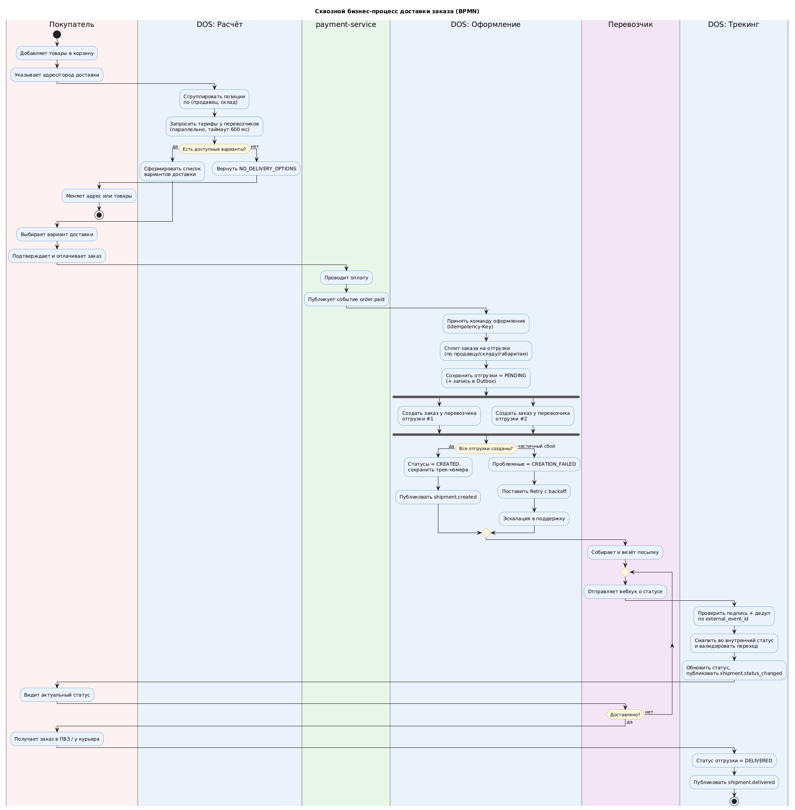
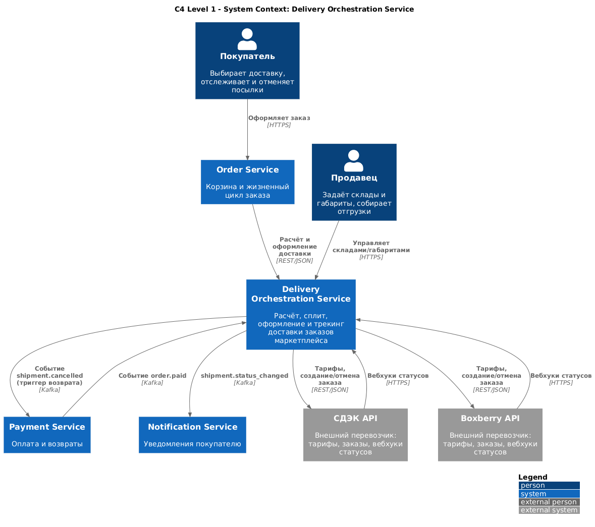
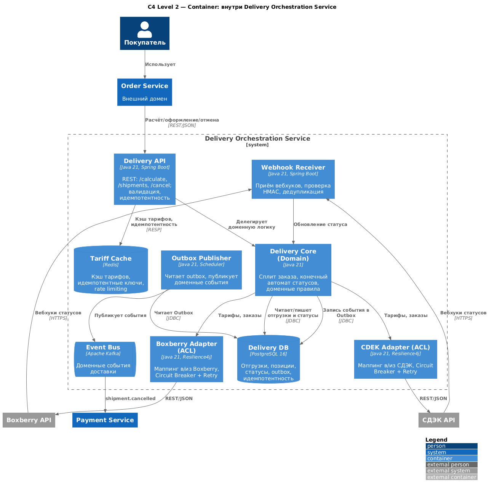
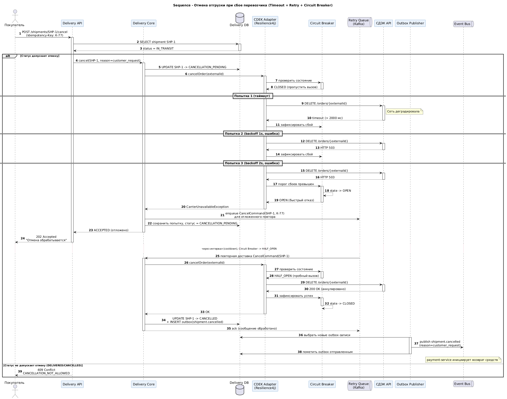
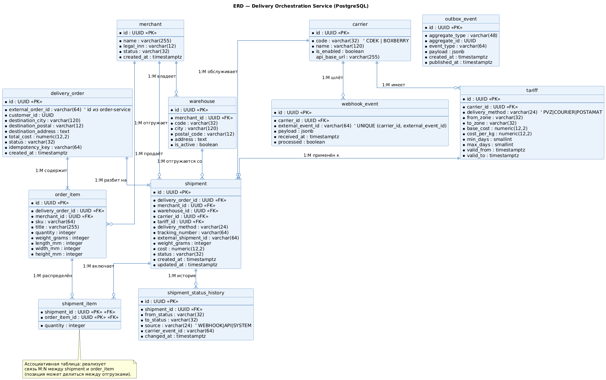
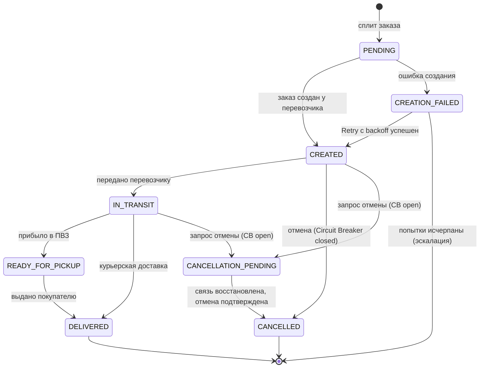

# Delivery Orchestration Service (DOS)

> Системный анализ и проектирование микросервиса доставки для маркетплейса.


---

## 1. Бизнес-контекст

Маркетплейс `MarketX` агрегирует товары от **тысяч независимых продавцов (merchant)**.
Один заказ покупателя физически почти никогда не отгружается одной посылкой: товары
лежат на разных складах, у разных продавцов, попадают под разные тарифы перевозчиков.

До внедрения DOS логика доставки была «размазана» по монолиту `order-service`:
расчёт стоимости делался синхронно при оформлении, перевозчик был захардкожен (только
СДЭК), а статусы посылок обновлялись cron-скриптом раз в час. Это давало три системные
боли:

- **Брошенные корзины** на шаге оформления из-за долгого (3–6 c) синхронного расчёта
  доставки, когда внешний API перевозчика тормозил.
- **Невозможность мультидоставки**: заказ с товарами от 2+ продавцов либо нельзя было
  оформить, либо он ехал одной отгрузкой с искажённой стоимостью.
- **Рассинхрон статусов**: покупатель видел «В пути», когда посылка уже была доставлена,
  что генерировало вал обращений в поддержку.

**Delivery Orchestration Service** выносит всю доменную логику доставки в отдельный
микросервис: он разбивает заказ на отгрузки (split), считает стоимость по каждому
перевозчику, оркестрирует создание заказов в СДЭК / Boxberry и держит единую модель
статусов, обновляемую по вебхукам перевозчиков в реальном времени.

### Цели проекта и метрики

| Цель | Метрика (KPI) | Базовое значение | Целевое значение |
|------|---------------|------------------|------------------|
| Ускорить расчёт доставки в корзине | p95 latency `POST /delivery/calculate` | 3 200 мс | **≤ 700 мс** |
| Снизить отказы оформления из-за доставки | Cart abandonment на шаге доставки | 11,4 % | **≤ 6 %** |
| Поддержать мультипродавцовые заказы | Доля заказов со сплитом, успешно оформленных | 0 % | **≥ 99 %** |
| Актуализировать статусы | Лаг между событием перевозчика и обновлением в UI | до 60 мин | **≤ 90 c (p95)** |
| Устойчивость к сбоям перевозчиков | Доля заказов, заблокированных недоступностью 1 перевозчика | ~ 100 % | **≤ 1 %** (graceful degradation) |
| Прозрачность тарифов | Доля заказов с расхождением «расчётная vs списанная стоимость» > 5 % | 4,1 % | **≤ 0,5 %** |

### Границы системы (Scope)

**In Scope**

- Расчёт стоимости и сроков доставки по нескольким перевозчикам (СДЭК, Boxberry; ПВЗ,
  курьер, постамат).
- Сплит заказа на отгрузки (shipment) по правилам: продавец, склад, габариты, тариф.
- Оркестрация создания заказов на стороне перевозчиков (создание накладной, трек-номер).
- Единая модель статусов отгрузки и их синхронизация по вебхукам перевозчиков.
- Отмена/возврат отгрузки, инициированные покупателем или продавцом.
- Публикация доменных событий (`shipment.created`, `shipment.status_changed`, …) в шину.

**Out of Scope**

- Платёжная логика и возврат денежных средств (домен `payment-service`).
- Складская логистика и резервирование товара (домен `wms` / `inventory-service`).
- Расчёт и удержание комиссии маркетплейса с продавца (домен `billing`).
- Кабинет курьера и last-mile маршрутизация собственной курьерской службы.
- Юридический документооборот с перевозчиками (EDI/договоры).
- Уведомления покупателю (домен `notification-service` – DOS лишь публикует события).

---

## 2. Архитектурный подход

DOS – это **stateless микросервис** в составе доменной платформы маркетплейса,
построенный по принципам **Domain-Driven Design** и **Event-Driven Architecture**.

- **Стиль интеграции**: синхронный **REST API** (расчёт, оформление, отмена – для
  фронта и `order-service`) + асинхронный **обмен событиями** через брокер (Apache
  Kafka) для статусов и интеграции с другими доменами.
- **Внешние перевозчики** скрыты за паттерном **Anti-Corruption Layer**: для каждого
  перевозчика – свой адаптер (`cdek-adapter`, `boxberry-adapter`), реализующий единый
  внутренний интерфейс `CarrierGateway`. Это позволяет добавлять перевозчиков без
  изменения доменного ядра.
- **Отказоустойчивость**: вызовы внешних API обёрнуты в **Circuit Breaker + Retry с
  экспоненциальным backoff и идемпотентными ключами**. При «открытом» предохранителе
  расчёт деградирует на закэшированные тарифы (graceful degradation).
- **Гарантии доставки событий**: паттерн **Transactional Outbox** – доменное событие
  пишется в БД в одной транзакции с изменением состояния, отдельный publisher вычитывает
  outbox и публикует в Kafka (at-least-once + идемпотентные консьюмеры).
- **Идемпотентность вебхуков**: каждое входящее событие перевозчика дедуплицируется по
  `(carrier, external_event_id)`.

### Стек технологий

| Слой | Технология | Обоснование |
|------|------------|-------------|
| Язык / рантайм | Java 21, Spring Boot 3.x | Стандарт для доменных сервисов платформы |
| Синхронный API | REST (OpenAPI 3.0), JSON | Контракт-фёрст, кодогенерация клиентов |
| Асинхронный обмен | Apache Kafka | Партиционирование по `order_id`, ordering гарантии |
| Хранилище | PostgreSQL 16 | Транзакции, JSONB для сырых ответов перевозчиков |
| Кэш / тарифы | Redis | Кэш тарифных матриц, идемпотентные ключи, rate limiting |
| Resilience | Resilience4j | Circuit Breaker, Retry, RateLimiter, TimeLimiter |
| Наблюдаемость | OpenTelemetry, Prometheus, Grafana | Трейсинг сквозного процесса доставки |
| Оркестрация процессов | Camunda 8 (Zeebe) | Долгоживущий процесс жизненного цикла отгрузки |
| Контейнеризация | Docker, Kubernetes | Горизонтальное масштабирование stateless-инстансов |

---

## 3. Навигация по репозиторию

```
delivery-service/
├── README.md                     ← вы здесь: контекст, цели, scope, стек
├── requirements/
│   ├── user_stories.md           ← User Stories + Acceptance Criteria (Gherkin)
│   └── use_cases.md              ← Спецификации Use Case по акторам
├── diagrams/
│   ├── bpmn.puml                 ← сквозной бизнес-процесс (BPMN, пулы/дорожки)
│   ├── c4_model.puml             ← C4: Context + Container
│   ├── sequence.puml             ← Sequence: отмена отгрузки + сбой перевозчика
│   ├── erd.puml                  ← ER-модель БД (PK/FK, кардинальность)
│   └── bpmn_core.xml             ← BPMN 2.0 XML подпроцесса (Camunda/Storm BPMN)
└── api/
    └── specification.yaml         ← OpenAPI 3.0: POST /delivery/calculate
```

### Как читать проект

1. Начните с этого README – он задаёт контекст и границы.
2. Перейдите в `requirements/` – что система должна делать и почему.
3. Изучите `diagrams/` – как это устроено (от бизнес-процесса к данным):
   - `bpmn.puml` → процесс глазами бизнеса;
   - `c4_model.puml` → архитектура (контекст → контейнеры);
   - `sequence.puml` → самый сложный технический сценарий;
   - `erd.puml` → модель данных.
4. Контракт интеграции – в `api/specification.yaml`.

---

## 5. Диаграммы

Ключевые схемы проекта – от бизнес-процесса к данным: сквозной процесс (BPMN), архитектура (C4: контекст и контейнеры), главный технический сценарий (Sequence), модель данных (ERD) и жизненный цикл отгрузки.

### Сквозной бизнес-процесс (BPMN)

Весь путь заказа по дорожкам сервиса: расчёт тарифа, сплит на отгрузки, оформление у перевозчика и трекинг до выдачи; видны точки ветвления на мультидоставку и отмену.



### C4 – System Context

Место сервиса в экосистеме маркетплейса: кто им пользуется (покупатель, продавец), с какими доменами он общается (Order/Payment/Notification по Kafka) и какие внешние перевозчики подключены (СДЭК, Boxberry) – синхронно по REST и через вебхуки статусов.



### C4 – Container

Внутреннее устройство сервиса: доменное ядро с конечным автоматом и сплитом, адаптеры перевозчиков как Anti-Corruption Layer с Circuit Breaker + Retry, приём вебхуков с проверкой HMAC и дедупликацией, надёжная публикация событий через Outbox.



### Sequence – отмена отгрузки при сбое перевозчика (Timeout + Retry + Circuit Breaker)

Особенность – устойчивость к отказу внешнего API: отмена отгрузки уходит в `CANCELLATION_PENDING`, размыкается Circuit Breaker, а после восстановления связи отмена подтверждается и через Outbox триггерит возврат средств.



### ER-модель данных

Модель данных доставки: заказ дробится на отгрузки (`shipment`), история статусов вынесена в отдельную таблицу, а `webhook_event` и `outbox_event` дают идемпотентный приём вебхуков и надёжную доставку событий (паттерны Inbox/Outbox).



### Жизненный цикл отгрузки (диаграмма состояний)

Диаграмма состояний отгрузки от сплита заказа до выдачи покупателю: основной
поток `CREATED → IN_TRANSIT → READY_FOR_PICKUP/DELIVERED`, обработка ошибок
создания у перевозчика (retry с backoff, эскалация при исчерпании попыток) и
сценарии отмены, включая отложенную отмену через `CANCELLATION_PENDING` при
недоступности внешнего API (Circuit Breaker open):



---

## 4. Глоссарий

| Термин | Определение |
|--------|-------------|
| **Order (Заказ)** | Покупка покупателя целиком; может содержать товары нескольких продавцов. |
| **Shipment (Отгрузка)** | Часть заказа, едущая одной посылкой от одного продавца одним перевозчиком. Результат сплита. |
| **Split (Сплит)** | Разбиение заказа на отгрузки по правилам (продавец, склад, габариты). |
| **Carrier (Перевозчик)** | Внешняя логистическая компания (СДЭК, Boxberry). |
| **Tariff (Тариф)** | Стоимость + срок доставки для конкретной комбинации откуда/куда/способ/габариты. |
| **PVZ (ПВЗ)** | Пункт выдачи заказов. |
| **ACL** | Anti-Corruption Layer – слой адаптеров, изолирующий доменное ядро от API перевозчиков. |
| **Outbox** | Таблица исходящих событий для надёжной публикации в Kafka. |

---

*Автор: Михаил Кузнецов · Senior Systems Analyst / Solution Architect.*
*Документ является проектным артефактом и не содержит реальных коммерческих данных перевозчиков.*
